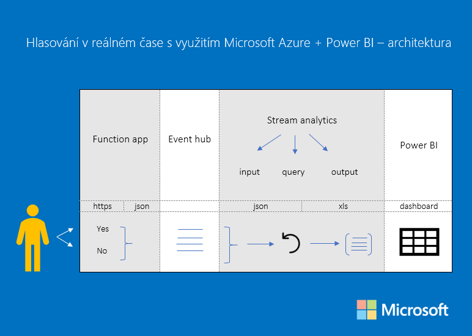

# Hlasovací portál s online vyhodnocováním dat

S využitím Microsoft Azure a Power BI jsme schopni vyhodnocovat data v reálném čase. Na architekturu se můžete podívat na níže uvedeném obrázku:



Function app nám slouží k tomu, aby https formát (funkce ano/ne pro hlasování, které máme napojené na gq kódy) převedla do textového formátu, který máme uložený v event hubu. Ten v sobě uchovává veškeré informace o našem hlasování. Stream analytics poté vezme naše data/informace ve formátu json a převede je do klasického xls formátu pomocí query. Power BI totiž pracuje pouze se strukturovanými daty databázového charakteru a právě díky konverzi z formátu json do xls můžeme data vizualizovat v Power BI. 

Celé video naleznete na odkazu www.aka.ms/hlasovani 

QR kódy pro URL funkcí vygenerujete na  http://goqr.me.

### Kód funkce pro hlasování "YES"

```javascript
module.exports = function (context, req) {
    var timeStamp = new Date().toISOString();
    context.bindings.outputEventHubMessage = {
        created: new Date(),
        vote: 'YES'
    };
    context.done();
};
```

### Kód funkce pro hlasování "NO"

```javascript
module.exports = function (context, req) {
    var timeStamp = new Date().toISOString();
    context.bindings.outputEventHubMessage = {
        created: new Date(),
        vote: 'NO'
    };
    context.done();
};
```

### Kód SQL dotazu pro Stream Analytics

```sql
SELECT
    1 as person,
    CAST(DATEADD(hour,1,created) as datetime) as Time,
    DATENAME (year, DATEADD(hour,1,created)) as Year,
    DATENAME (month, DATEADD(hour,1,created)) as Month,
    DATENAME (day, DATEADD(hour,1,created)) as Day,
    DATENAME (weekday, DATEADD(hour,1,created)) as WeekDay,
    DATENAME (hour, DATEADD(hour,1,created)) as Hour,
    DATENAME (minute, DATEADD(hour,1,created)) as Minute,
    UPPER(vote) as vote,
    CASE WHEN UPPER(vote)='YES' THEN 1 ELSE 0 END as voteyes,
    CASE WHEN UPPER(vote)='NO' THEN 1 ELSE 0 END as voteno
INTO
    [topowerbi]
FROM
    [fromeventhub]
```

